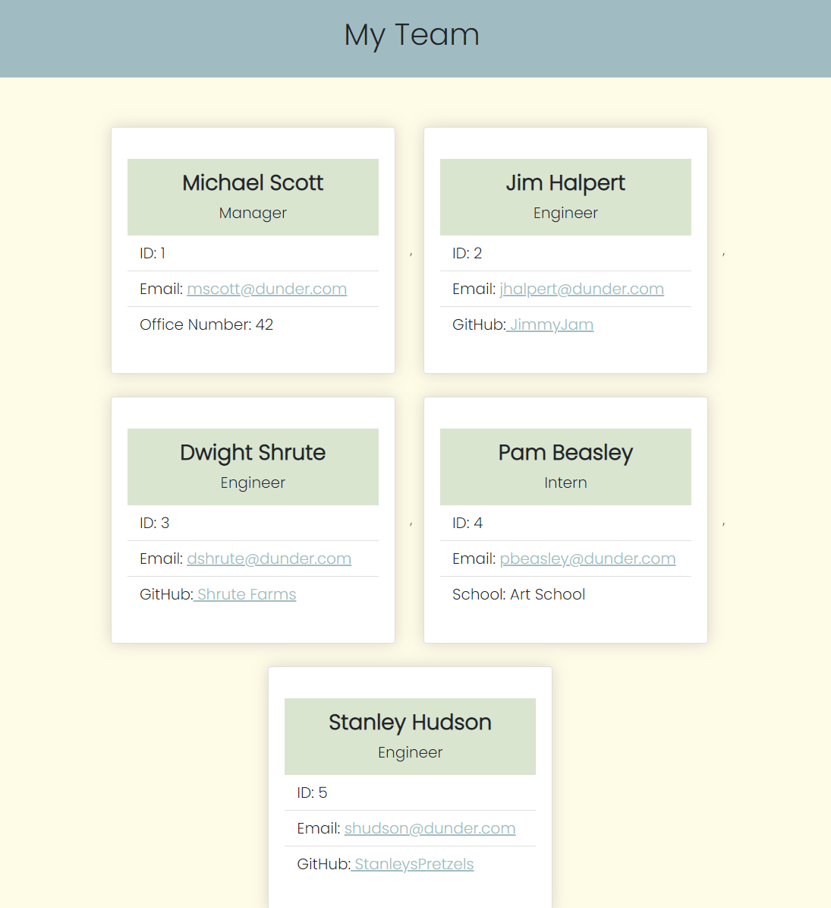

# 📋 Team Profile Generator 

<br>

## 🗂️ Table of contents
- [Overview](#overview)
  - [The Challenge](#the-challenge)
  - [Screenshot](#screenshot)
  - [Links](#links)
- [My process](#my-process)
  - [Built with](#built-with)
  - [User experience](#user-experience)
  - [Useful resources](#useful-resources)
- [Author](#author)

<br>
<hr>
<br>

# 📝Description
- an application that generates a webpage that displays a team's basic info for quick access to emails and GitHub profiles

<br>
<br>

# 📁 Overview 

## 📢 **The Challenge**

​
## User Story

```md
AS A manager
I WANT to generate a webpage that displays my team's basic info
SO THAT I have quick access to their emails and GitHub profiles
```

## Acceptance Criteria

```md
GIVEN a command-line application that accepts user input
WHEN I am prompted for my team members and their information
THEN an HTML file is generated that displays a nicely formatted team roster based on user input
WHEN I click on an email address in the HTML
THEN my default email program opens and populates the TO field of the email with the address
WHEN I click on the GitHub username
THEN that GitHub profile opens in a new tab
WHEN I start the application
THEN I am prompted to enter the team manager’s name, employee ID, email address, and office number
WHEN I enter the team manager’s name, employee ID, email address, and office number
THEN I am presented with a menu with the option to add an engineer or an intern or to finish building my team
WHEN I select the engineer option
THEN I am prompted to enter the engineer’s name, ID, email, and GitHub username, and I am taken back to the menu
WHEN I select the intern option
THEN I am prompted to enter the intern’s name, ID, email, and school, and I am taken back to the menu
WHEN I decide to finish building my team
THEN I exit the application, and the HTML is generated
```

### 📸 Screenshot 
​

​
​
### 📎 Links 
​
- Solution URL: [https://github.com/AveryCaldwell/Team-Profile-Generator](https://github.com/AveryCaldwell/Team-Profile-Generator)
- Video URL: [https://drive.google.com/file/d/1Y1BxdDhGIa6eY4UsD9mmbSgIKfIHJIZq/view](https://drive.google.com/file/d/1Y1BxdDhGIa6eY4UsD9mmbSgIKfIHJIZq/view)
- Sample HTML File: [https://github.com/AveryCaldwell/Team-Profile-Generator/blob/main/dist/index.html](https://github.com/AveryCaldwell/Team-Profile-Generator/blob/main/dist/index.html)

<br>
<hr>
<br>


## 💡 My process 

### 🔨 Built with 
- HTML
- CSS
- JavaScript
- Node.js
- Inquirer
- Jest

<br>

### 👤 User Experience
- Please see the [WalkThough Video](https://drive.google.com/file/d/1Y1BxdDhGIa6eY4UsD9mmbSgIKfIHJIZq/view) for a visual demonstration on how to use the app.
1. Because this app will require the use of the Inquirer package, ensure that you install and use Inquirer version 8.2.4. To do so, use the following command in your project folder: `npm i inquirer@8.2.4.`
2. The application will be invoked by using the following command: `node index.js`
3. When prompted for team members, enter their information.
4. Then an HTML file is generated that displays a nicely formated team roster based on user input.

<br>

### 📚 Useful resources 

- Inquirer Package - [Inquirer package](https://www.npmjs.com/package/inquirer/v/8.2.4)
- Jest Package - [Jest package](https://www.npmjs.com/package/jest) 
- Emojis - [Emojis](https://github.com/ikatyang/emoji-cheat-sheet)


<br>

## ✏️ Author 
- Avery Caldwell
- GitHub - [AveryCaldwell](https://github.com/AveryCaldwell)
